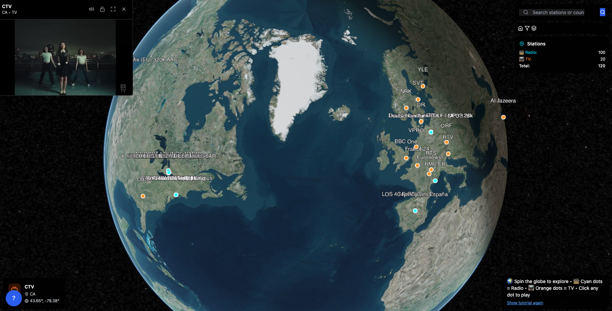

# Interactive 3D Globe for Live Media Streaming

An interactive 3D globe application that allows users to explore and stream live radio and TV stations from around the world. Built with React, Cesium.js, and Video.js.



## Features

- 🌍 Interactive 3D globe visualization using Cesium.js
- 📻 Live radio streaming from hundreds of stations worldwide
- 📺 Live TV streaming from various international channels
- 🎯 Geolocation-based station mapping
- 📱 Responsive design for desktop and mobile devices
- 🔍 Search and filter stations by country, genre, and type
- ▶️ Integrated media player with Video.js
- 🌓 Dark mode interface

## Technologies Used

- **Frontend**: React, Video.js, Tailwind CSS
- **3D Visualization**: Cesium.js
- **UI Components**: Floating UI, Lucide React Icons
- **State Management**: Zustand
- **Build Tool**: Vite
- **Data Sources**: iptv-org GitHub repository, custom radio station database

## Getting Started

### Prerequisites

- Node.js (v14 or higher)
- npm or yarn

### Installation

1. Clone the repository:
   ```bash
   git clone <repository-url>
   cd interactive-3d-globe-media-streaming
   ```

2. Install dependencies:
   ```bash
   npm install
   ```

3. Start the development server:
   ```bash
   npm run dev
   ```

4. Open your browser and navigate to `http://localhost:5173`

### Building for Production

```bash
npm run build
```

The built files will be in the `dist` directory.

### Deployment

```bash
npm run preview
```

## Project Structure

```
src/
├── components/     # React components
├── hooks/          # Custom React hooks
├── services/       # Data fetching services
├── store/          # Zustand store
├── data/           # Static data files
├── styles/         # CSS styles
└── App.jsx         # Main application component
```

## Data Sources

- **TV Streams**: [iptv-org GitHub repository](https://github.com/iptv-org/iptv)
- **Radio Stations**: Custom curated database with geographic coordinates

## Known Issues

- Some streams may not play due to CORS restrictions
- Not all TV channels have matching geographic coordinates
- Performance may vary on lower-end devices due to 3D rendering

## Contributing

1. Fork the repository
2. Create a feature branch (`git checkout -b feature/AmazingFeature`)
3. Commit your changes (`git commit -m 'Add some AmazingFeature'`)
4. Push to the branch (`git push origin feature/AmazingFeature`)
5. Open a Pull Request

## License

This project is licensed under the MIT License - see the [LICENSE](LICENSE) file for details.

## Acknowledgments

- [Cesium.js](https://cesium.com/platform/cesiumjs/) for the 3D globe visualization
- [Video.js](https://videojs.com/) for the media player
- [iptv-org](https://github.com/iptv-org) for the TV stream database
- [Tailwind CSS](https://tailwindcss.com/) for styling

## Contact

For questions or feedback, please open an issue on the GitHub repository.

